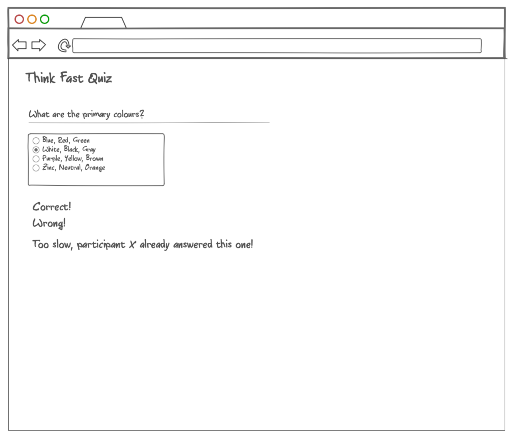

# Think Fast Quiz

A quiz game where a question is presented on the screen for each participant, and the participant that fastest answers the question wins.

The application only needs to hold one "game" at a given time, which means that whenever a new user opens the application main screen, they automatically join the only game running in the server and are presented with the current question.

When a participant correctly answers a question, all other participants should be notified immediately that the current question is already answered and that they missed the chance to answer in time. The application should then present the next question from a pool of questions.

**If two or more participants answers a question correctly the fastest one should win, i.e. the one that the application server process first.**

When the game reaches the last question in the pool of questions it should cycle back to the first question again.


*An example of what the application main screen could look like*

## Scenarios that the application should implement

### Enter to play

**Given** a user that wants to play the quiz <br/>
**When** the user opens the application main screen (home web page) <br/> 
**Then** the user should automatically join the game as a participant <br/>
**And** be presented with the current question <br/>

### Answer a question incorrectly

**Given** a participant in main screen with the current question presented <br/>
**When** the participant chooses an answer that is not the correct one <br/>
**Then** the application should inform the participant about the wrong selection <br/>

### Answer a question correctly

**Given** a participant in the main screen with the current question presented <br/>
**When** the participant chooses an answer that is the correct one <br/>
**Then** the application should greet the participant to have chosen the right answer <br/>
**And** inform all the other participants that other participant has correctly answered the previous question <br/>
**And** the next question should be presented to all participants <br/>

## Areas of evaluation

- Code readability
- Code organization
- Implementation correctness
- Tooling (dependency management, environment isolation, building)
- Tests
- Deployment

## How should the solution be provided?

Clone this repository, implement your solution and share with us your repository with your implementation.

## What technology stack can be used?

Any technology stack of choice of the following programming languages: Java/Kotlin, Python, Javascript.
Check with us in case that you want to use any other programming language not specified above.

## What should the solution contain?

- All the source code with the application requirements implementation
- Additional files or tools required to manage the application requirements
- Additional files to allow the creation of build artifacts that the application is compromised of. 
- Instructions on how to build and run the application in multiple modes:
  - Using standalone build artifacts like Docker container with any supported container management tool, and if your solution happens to need more than one container, then provide the necessary instructions and assets to run all of them together as one.
  - And running the application in stand alone without any container tool. 

## Running the app

Simply run from the root directory:

```bash
docker-compose up --build
```

## Running tests

```bash
docker compose exec backend pytest tests/
```